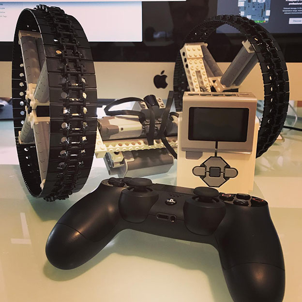

# LEGO® Mindstorms® EV3 and a PS4 Controlled Robot

This is the source code for a LEGO Mindstorms robot controlled by a PS4 controller.

> Instagram post here:  
> https://www.instagram.com/p/Bz1LX8kHGAU/

---

## Repo Resources

- [EV3 and a PS4 Controller](https://github.com/codeadamca/ev3-python-ps4)

 

